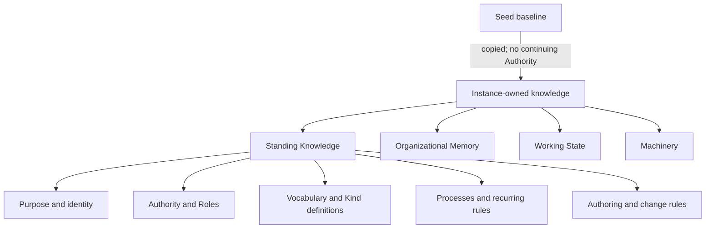

# Knowledge model

This file is the canonical map of knowledge in an Organizational Seed
Instance. Two independent questions locate every artifact:

1. **Where did it come from?** The Seed supplies a reusable baseline; the
   Instance may add or adapt knowledge for its own work.
2. **How does it behave?** Knowledge is Standing Knowledge, Organizational
   Memory, Working State, or Machinery.

After instantiation, the Instance owns every current file, including files
that began in the Seed. A later Seed change is only a candidate for local
review and never carries upstream Authority.

## The four knowledge classes

The terms themselves are defined in [CONTEXT.md](CONTEXT.md); this table maps
them to repository responsibilities and change routes.

| Class | Typical homes | Change route |
|---|---|---|
| **Standing Knowledge** | purpose, Authority, Roles, vocabulary, Kind definitions, Processes, authoring and change rules | Governed change with evidence, an exact diff, review, and the required ruling |
| **Organizational Memory** | Records, Decisions, Lessons, accepted or rejected Tasks, Git history | Append through ordinary work; correct by superseding; deletion requires Founder approval |
| **Working State** | open Tasks, current priorities, draft Processes, proposed changes | Update through the Process performing the work; existence grants no standing Authority |
| **Machinery** | tools, generated or mechanically verified indexes, agent files, skills, connectors | Replace through repository maintenance; it may enforce or project but never own meaning or Authority |

The class follows responsibility, not file extension. A `_kind.md` definition
is Standing Knowledge even though the Record members beside it are
Organizational Memory. A Proposal is Working State while awaiting Judgment;
its recorded ruling becomes Organizational Memory after resolution.

## What is governed

**Conserved** is a change rule, not a fifth knowledge class. Standing Knowledge
is conserved because altering what future work obeys requires organizational
Judgment. In this Seed that includes:

- organizational purpose and the knowledge model itself;
- Authority and Role charters;
- vocabulary and Kind definitions;
- active Processes and their contracts;
- authoring, Lesson-lifecycle, and governed-change rules.

The repository paths and approval tracks are defined once in
[ORG.md](ORG.md). [AUTHORING.md](AUTHORING.md) supplies the review questions.

## How the organization evolves

Three Seed Processes keep the classes separate:

1. [Handle uncovered work](processes/handle-uncovered-work.md) safely performs
   the smallest useful work when no active Process fits and leaves a draft or
   Lesson when reuse is plausible.
2. [Review Lessons](processes/review-lessons.md) decides whether preserved
   teaching should be absorbed, kept, rerouted, or closed.
3. [Change Standing Knowledge](processes/change-standing-knowledge.md) is the
   one mutation route for creating, correcting, improving, merging, renaming,
   or retiring governed knowledge.

An obvious error may enter Change Standing Knowledge directly with evidence;
it does not need a ceremonial Lesson. A Lesson changes no behavior until an
approved Change Standing Knowledge performance integrates the receiving diff.
Creating a Process is not a separate mutation system: uncovered work may leave
a draft, and Change Standing Knowledge may later create the active Process.
