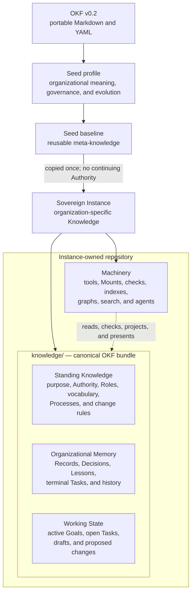

# Knowledge model

This file is the canonical map of Knowledge and Machinery in an Organizational
Seed Instance. Two questions locate every artifact:

1. **Where did it come from?** The Seed supplies a reusable baseline; the
   Instance may add or adapt artifacts for its own work.
2. **What is it?** An artifact is either Knowledge or Machinery. Knowledge is
   Standing Knowledge, Organizational Memory, or Working State.

After instantiation, the Instance owns every current file, including files
that began in the Seed. A later Seed change is only a candidate for local
review and never carries upstream Authority.

## Architecture at a glance

The organization is defined on top of OKF, not inside a particular agent,
database, or service. OKF supplies the portable file format. The Seed's local
profile supplies the organizational meaning, governance, and learning system.
A Seed is copied into a sovereign Instance; from then on, that Instance owns
its Knowledge and its evolution.

The boundary is deliberate: Machinery can be replaced without moving the
organization's meaning or Authority. Git owns versions, review, integration,
rollback, and history for the bundle at an exact commit.

## Knowledge and Machinery

The terms themselves are defined in [CONTEXT.md](CONTEXT.md); this table maps
the three Knowledge classes to repository responsibilities and change routes.

| Class | Typical homes | Change route |
|---|---|---|
| **Standing Knowledge** | purpose, Authority, Roles, vocabulary, Kind definitions, Processes, authoring and change rules | Governed change with evidence, an exact diff, review, and the required ruling |
| **Organizational Memory** | Records, Decisions, Lessons, accepted or rejected Tasks, Git history | Append through ordinary work; correct by superseding; deletion requires Founder approval |
| **Working State** | active Goals, open Tasks, draft Processes, proposed changes | Update through the deciding Role or Process that owns the work; existence grants no standing Authority |

Machinery is not Knowledge. It is the replaceable infrastructure that reads,
checks, projects, or presents Knowledge: tools, generated or mechanically
verified indexes, agent files, skills, and connectors. If deleting Machinery
would delete organizational meaning or Authority, that meaning has been stored
in the wrong place.

A Knowledge class follows responsibility, not file extension. A `_kind.md`
definition is Standing Knowledge even though the Record members beside it are
Organizational Memory. A Proposal is Working State while awaiting Judgment;
its recorded ruling becomes Organizational Memory after resolution.

## What is governed

**Conserved** is a change rule, not a fourth knowledge class. Standing Knowledge
is conserved because altering what future work obeys requires organizational
Judgment. In this Seed that includes:

- organizational purpose and the knowledge model itself;
- Authority, access classification, and Role charters;
- vocabulary and Kind definitions;
- active Processes and their contracts;
- authoring, Lesson-lifecycle, and governed-change rules.

The repository paths and approval tracks are defined once in
[ORG.md](ORG.md). [ACCESS.md](ACCESS.md) defines discovery scopes and mutation
ceremonies without granting Authority. [AUTHORING.md](AUTHORING.md) supplies
the review questions.

## How the organization evolves

Three Seed Processes keep the Knowledge lifecycle clear:

1. [Handle uncovered work](processes/handle-uncovered-work.md) safely performs
   the smallest useful work when no active Process fits and leaves a draft or
   Lesson when reuse is plausible.
2. [Review Lessons](processes/review-lessons.md) decides whether preserved
   teaching should be absorbed, kept, rerouted, or closed.
3. [Change Standing Knowledge](processes/change-standing-knowledge.md) is the
   one mutation route for creating, correcting, improving, merging, renaming,
   or retiring governed knowledge.

An obvious error may enter Change Standing Knowledge directly with evidence;
it does not need a ceremonial Lesson. A Lesson changes no behavior until an
approved Change Standing Knowledge performance integrates the receiving diff.
Creating a Process is not a separate mutation system: uncovered work may leave
a draft, and Change Standing Knowledge may later create the active Process.

```mermaid
flowchart LR
    Purpose["Purpose"] -. durable direction when useful .-> Goal["Optional Goal"]
    Intent["Bounded human request"] --> Fit
    Fit{"Active Process fits?"}
    Fit -->|yes| Task["Task under one Process"]
    Fit -->|no| Uncovered["Handle uncovered work"]
    Uncovered --> Task
    Uncovered -. repeatable gap .-> Draft["Draft Process or other candidate"]
    Goal -. when relevant .-> Task

    Task --> Perform["Perform work<br/>cite Records"]
    Perform --> Checks["Mechanical Checks"]
    Checks --> Judgment["Human Judgment"]
    Judgment --> Outcome["Outcome and receipt"]
    Outcome --> Lesson["Lesson"]

    Lesson --> Review["Review Lessons"]
    Review -->|keep or reroute| Lesson
    Review -->|close with reason| Memory["Organizational Memory"]
    Review -->|absorb| Change["Change Standing Knowledge"]
    Draft --> Change
    Error["Directly evidenced error<br/>or changed intent"] --> Change

    Change -->|approved and integrated| Standing["Standing Knowledge"]
    Change -->|rejected with reason| Memory
    Standing -. improves future .-> Fit
```

This is the compounding loop: performed work can create evidence, evidence can
create a Lesson, and governed change can improve what future work follows.
Keeping, rerouting, closing, or rejecting is also a valid outcome; the system
does not force every observation into Standing Knowledge.

Goal and Process do not point directly at each other. When a Task advances a
Goal, their relationship lives in that Task: one Goal may need several
Processes, while the same Process can serve different Goals without being
rewritten whenever priorities change. A Task with no durable Goal is valid.
