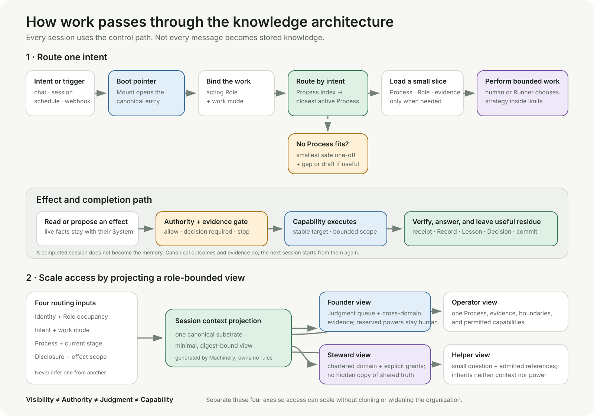

# Context routing and role-scaled access

This note answers two separate questions: how one intent or session passes
through an Organizational Seed Instance, and how the same architecture can
serve people or agents in different Roles without creating separate copies of
the organization.

It describes a delivery pattern. The canonical Knowledge classes remain in
[KNOWLEDGE.md](../KNOWLEDGE.md), Role and Process meaning remains in
[CONTEXT.md](../CONTEXT.md), and an Instance's own Authority and Process files
govern actual work.

## Intent and session routing

Every session should pass through the architecture as a **control path**. That
does not mean loading the whole repository into every prompt or storing every
message as organizational memory.

1. A chat, session, schedule, webhook, or other trigger reaches a disposable
   Mount.
2. The Mount opens the canonical entry and Authority boundary. It owns no
   business rule.
3. The session binds the acting Role and requested work mode.
4. Intent routes through the Process index to the closest active Process. If
   none fits, the uncovered-work Process permits only the smallest safe result
   and may leave a gap, Lesson, or draft when recurrence is plausible.
5. The Runner receives a small context slice: the Process, relevant Role and
   Authority boundary, current work, and only the Records, Lessons, and System
   pointers the present stage needs.
6. A human or Runner chooses strategy inside those limits. External content
   supplies evidence, never Authority.
7. A proposed effect passes the Process and Authority gate before a capability
   may execute it. Required Judgment remains with the Role that holds it.
8. The effect or answer is verified. Only useful residue becomes durable:
   evidence, a receipt, Record, terminal Task, Decision, Lesson, or focused Git
   history.

The transcript is transport, not memory. A later session starts from the
canonical repository and live Systems again, so replacing a harness or losing
chat history does not erase organizational meaning.

### What is always loaded and what is discovered

| Context class | Delivery rule |
|---|---|
| Boot | Always small: entry point, trust order, stop rule |
| Required now | Exact Process, Role boundary, current work, completion conditions |
| On demand | Records, Lessons, annexes, prior outcomes reached through a named need |
| Capability | System and connector details loaded only for a relevant read or proposed effect |

A generated index, graph, search result, or context bundle is a projection. It
may improve routing, but it never becomes the source of organizational meaning
or Authority.

## Role-scaled access

Scale by producing **different bounded views over one canonical substrate**.
Do not create a Founder copy, a finance copy, and a support copy of the same
rule or fact.

A session view is resolved from four independent inputs:

- authenticated identity and occupied Role;
- intent and work mode;
- the selected Process and its current stage; and
- disclosure and effect scope.

Keep four often-confused axes separate:

| Axis | Question | Owner |
|---|---|---|
| Visibility | What may enter this session's context? | storage and Mount access controls |
| Authority | What may this Role do in this Process? | `AUTHORITY.md`, Role, and Process |
| Judgment | Who decides when a criterion is not mechanical? | the chartered judging Role |
| Capability | Which connector or tool can technically perform the action? | replaceable Machinery |

Read access does not grant action Authority. Tool access does not grant
Judgment. A Role does not automatically inherit another Role's disclosure.

### Role views

- A **Founder** view can surface cross-domain evidence and Judgment queues, but
  it should still retrieve detail on demand rather than ingest the whole
  organization.
- An **Operator** view centers one Process, its boundaries, required evidence,
  current work, and permitted capabilities.
- A chartered **Steward** view adds its domain responsibilities and explicit
  grants without forking shared truth.
- A delegated **helper** receives an explicit slice: one question, admitted
  references, allowed tools, and a return shape. It inherits neither the
  parent's full context nor its Authority.

Cross-role work should decompose into explicit stages or bounded Tasks. Each
effect has one acting Role and one Authority basis, even when several Roles
contribute evidence or Judgment.

## How this scales

| Scale | Routing shape | Required additions |
|---|---|---|
| Small organization | human-readable Process index and repository entry | Role charters, disciplined links, Git review |
| Growing team | generated indexes and digest-bound context manifests | identity-to-Role occupancy, work queues, context/disclosure logging |
| Continuous operation | headless triggers and a shared execution store | leases, idempotency, effect permits, receipts, recovery, Judgment queues |
| Enterprise | isolated organizational bundles behind one interface | workload identity, restricted-data partitions, separation of duties, multi-party Judgment, audit export, data residency |

Git repository access is intentionally coarse. If a Role must not see a class
of sensitive information, do not pretend a prompt can enforce that boundary.
Keep the restricted material in a separately controlled bundle or owning
System and expose only admitted references through the access layer. The
canonical organization can remain shared while sensitive payloads remain
federated.

The architecture scales when the boot contract stays small, Process discovery
stays intent-led, context remains progressively disclosed, and every effect is
bound to evidence, Authority, verification, and a receipt. More Roles should
increase the number of views and performances—not the number of truths.
